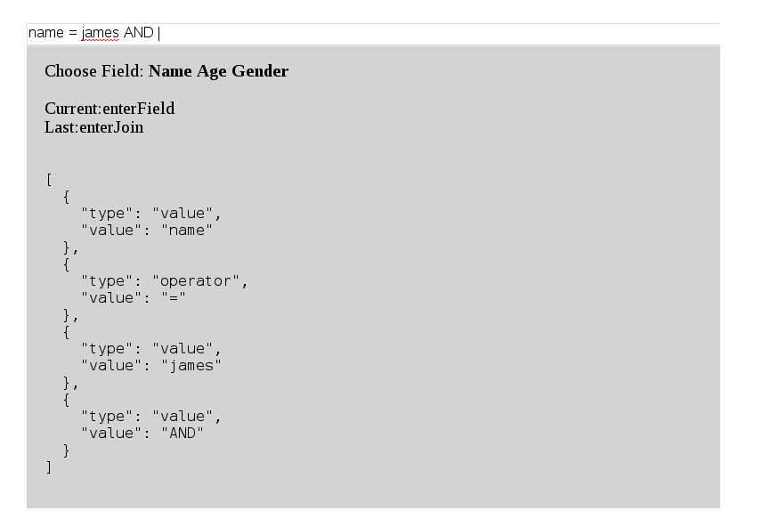

# Overview 

**SmartFilter** is a jQuery plugin to build powerful key-value search expressions.

It provides auto-complete (for fields, operators and values), and converts text 
into a JSON model that can be sent to a server and processed (eg, search).

Try it below!: 

<input id = "exampleSearch" />

-

   

# Screenshots

# Setup
	
Some HTML like this; 

	
 
		<input id = "search" />

		
Type to get started.

	

Then some Javascript;

	

Obviously you need to include the ``smartfilter.js`` file somewhere on the page too.

# Config

| Config field | Description                                                   |
|--------------|---------------------------------------------------------------|
| ``input``    | The search field to attach to and setup. Required.            |
| ``debug``    | Print debug information in the dropdown.

# CSS

| CSS Rule     | Description                                                   |
|--------------|---------------------------------------------------------------|
| ``.smartFilterDescription``    | The description box                         |

